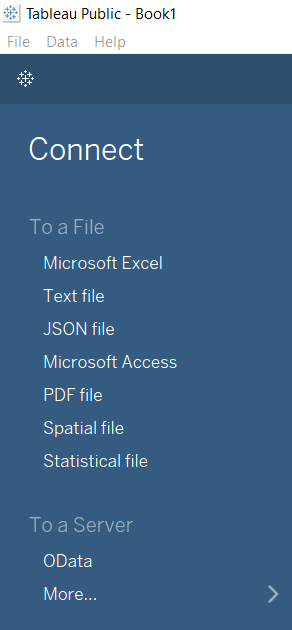
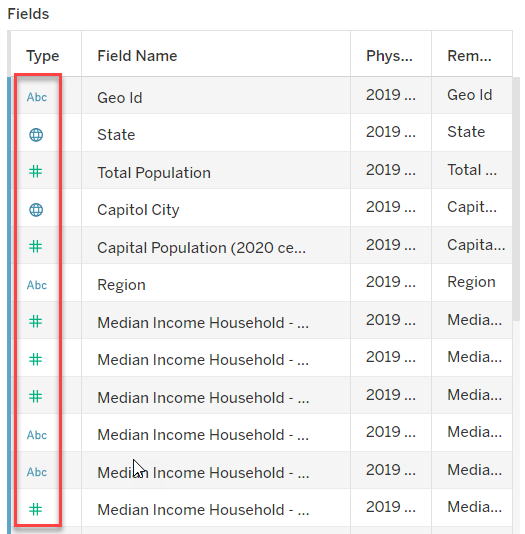
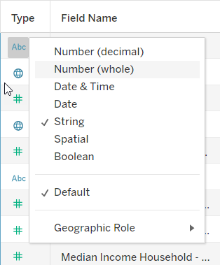
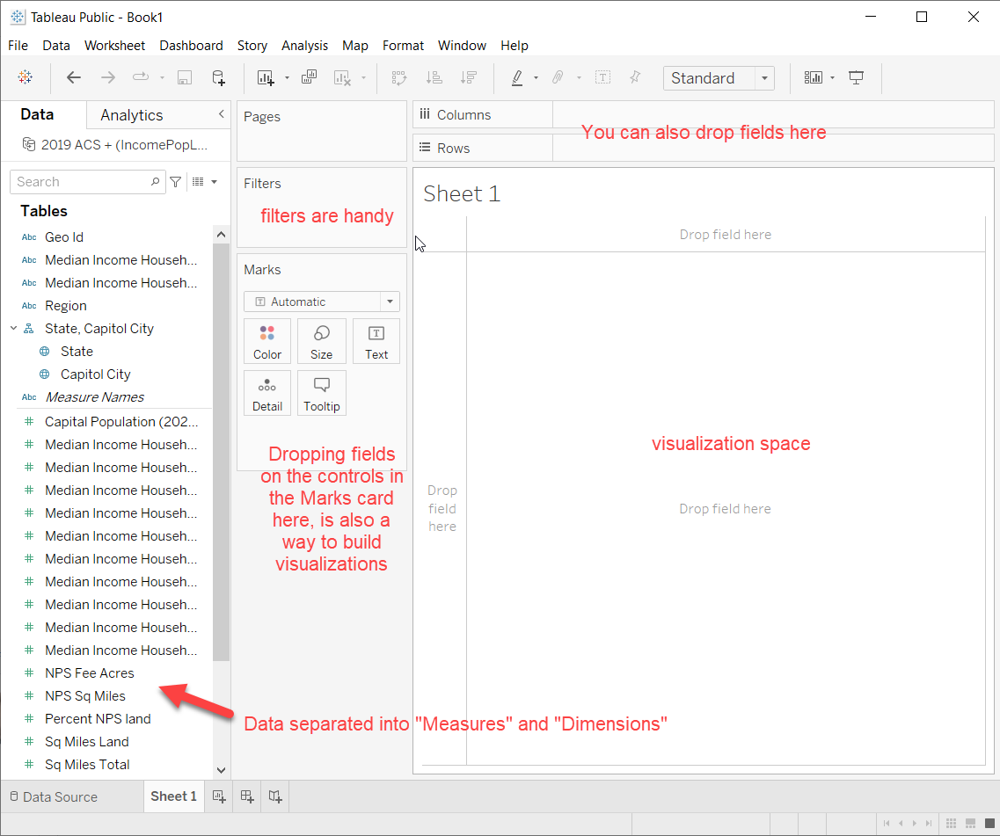
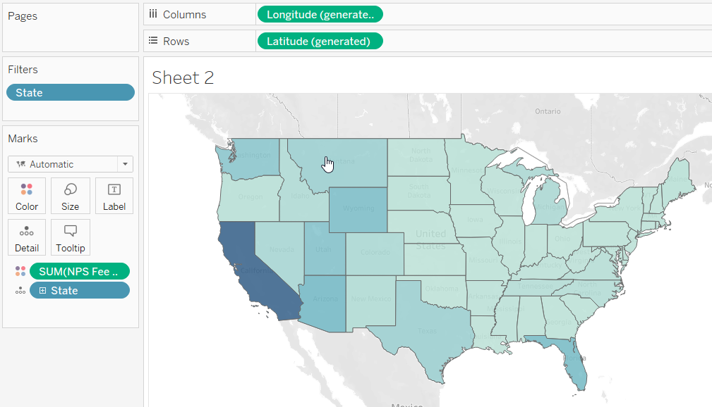
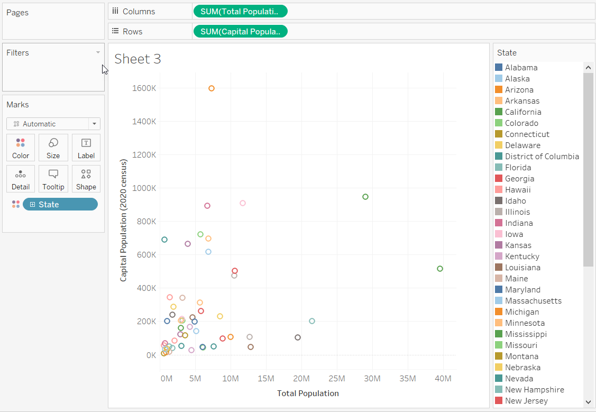
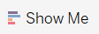
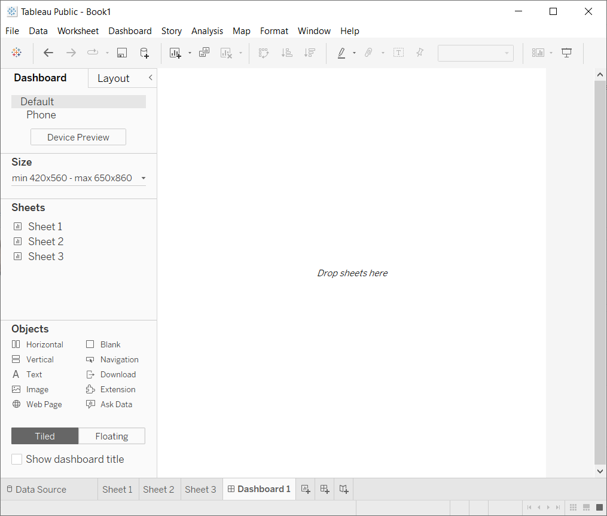
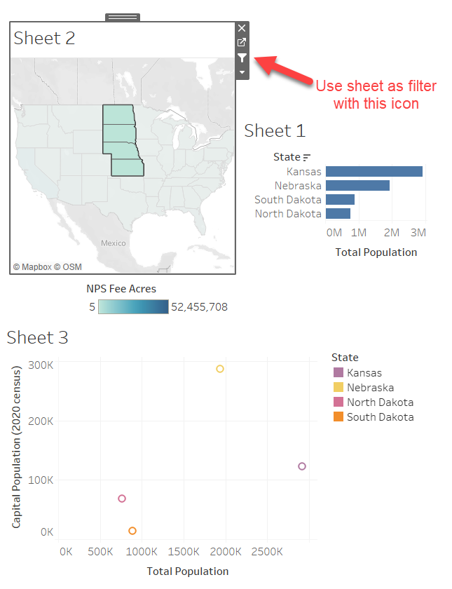

# Introduction to Tableau Public 

Tableau, according to their [website](https://tableau.com), is "a visual analytics platform transforming the way we use data to solve problems—empowering people and organizations to make the most of their data." The company is focused on business analytics, but there are many applications for this software whose strength is building interactive webplatforms for visual data analytics.

There are different versions of the software, mainly Tableau Public and Tableau Desktop. The latter requires a license, but if you are a student or a teacher, you can get a free, renewable, 1-year license from the [Tableau Academic Programs page](https://www.tableau.com/community/academic). There is also a licensed product called Tableau Prep - a software for prepping data to be used by Tableau. ([OpenRefine](https://openrefine.org/) is a similar, license-free, data cleaning tool).

Tableau Public is available for everyone without status verification, but it has access to less data on the Tableau Server. Also, and IMPORTANTLY, all of the workbooks are publicly posted on the web. You can only save workbooks to your personal computer with Tableau Desktop. DO NOT create any workbooks with sensitive or private data in Tableau Public.

## Workshop Resources
 - Software - access here: [Tableau Public](https://public.tableau.com/s/)
 - Data - download from this repo's [data folder](https://github.com/frizatch/Tableau-Intro-to-TableauPublic/tree/main/data)

## Workshop Goals
By the end of this workshop, you will be able to:
- Load data into Tableau
- Assess how Tableau has classified your data
- Make various data visualizations, including maps
- Create an interactive dashboard that ties your visualizations together

## Outline
- [Why Tableau?](#why-tableau)
- [Tableau Terms - a Glossary](#glossary)
- [Getting Started](#start)
- [Connecting to Data](#connect-data)
- [Data classification](#data-class)
- [Creating visualizations](#visualize)
- [Making a Dashboard](#dashboard)
- [Connecting to PDF Data](#pdf-data)

##   Why use Tableau?

Tableau's main purpose is to create a platform for visual data exploration. Here are some of its strengths:

- Easily create interactive dashboards
- Compatibility with a good range of data files
- Connections to web-based data
- Built-in "pop-ups" for ease of information access
- Drag and drop GUI

##   A Tableau Glossary

Tableau uses some terms that you may not have seen before, or uses these terms differently from what you're used to, so here is a quick guide to clarify what you'll see:

**Measures**: *quantitative data*

**Dimensions**: *qualitative or categorical data*

**Marks**: *all the rows of your data. One mark equals one row.*

**Marks card**: *control sparce for adding further detail into your visualization.* 
- Click on one of the properties in the box to manually change the way that your visualization appears. 
- Drag and drop Dimensions or Measures onto properties in the Marks card to change the context or detail of that Dimension or Measure.

**Sheets**: *Where you create your data visualization. Each visualization will require its own sheet.*  

**Dashboard**: *The interactive display of multiple visualizations from the Sheets.*

##   Getting Started

In order to get your Tableau Public connected to some data, you need a) Tableau Public and b) some data!

Under the Workshop Resources at the top, you'll find links to get both. You may be at a computer that already has Tableau Public so you're set on the software. If not, go to the [Tableau Public Page](https://public.tableau.com/s/), enter your email to sign up for an account and download the app. You should then be able to launch it from your machine. For the data, you'll find it in a data folder where you can click on each file to get a download link. For the first part of the workshop, you only need to download:

[IncomePopLand_US_2019.xls](https://github.com/frizatch/Tableau-Intro-to-TableauPublic/blob/main/data/IncomePopLand_US_2019.xlsx)

This data is a spreadsheet put together for this workshop about the 50 U.S. states plus the District of Columbia and Puerto Rico.

The information is fairly random, but largely consists of:
- Population data for states and capital cities (ACS 2019 and census 2020)
- Land, water, and National Park Service areas for each state
- Median household income by race and age (ACS 2019)

We'll explore this data and play with the relationships we see in it! Open it up with Excel and see what's there so you know what you're working with.

##   Connecting to Data

 When you first open Tableau Public, you'll mainly see a white space with a blue column on the left saying "Connect" in big letters inviting you to point Tableau Public to where your file(s) are sitting. There are lot of different options, but we'll use the first under "To a file", Microsoft Excel.

Click on "Microsoft Excel" and browse to where you put IncomePopLand_US_2019.xls. After selecting your file, Tableau will open up a page where you can examine your data! Note: If your excel file has more than one sheet in it, you'll select the sheet you want by dragging it from the lefthand side to the blank area in the middle.

##   Automatic Data Classification

The next step is to check on how Tableau classified your data. The software will try to determine if a column of information or field is numeric, a string (text), geographic or a date. Little symbols appear by the field names in both the data table and the field summary area.

If Tableau gets something wrong, you can click on the symbol and force Tableau to select a data type you know is appropriate. Notice, for instance, a few of the Median Household Income columns have been erroneously classified as "string" because there are null values in the data that complicate how Tableau functions.

The green and blue colors of the data type icons show whether Tableau has decided this field is a "Measure" or a "Dimension."

Real data is always MESSY and examining what you have is *always* important for efficiently working with the data. Tableau's is not a space where you can clean messy data, it is purely a visualization tool. Before connecting to the data, it is best to tidy it up in excel or OpenRefine, or even Tableau Prep if you get a license for the software.

##   Creating Data Vizualizations

Now we get to bring our data to life by creating (reasonable!) visualizations with our quantitative (Measures) and categorical (Dimensions) data!

In the lower left, click on the prompt that says go to worksheet, or click on the symbol that looks like a mini mini bar graph with a plus sign. When you do, you'll create "Sheet1" where your first visual will live. You'll see something like this:

The idea is to drag data layers from the area on the left to the various areas in the workspace or in the Marks card to start seeing how the data interacts. If you're happy with one visual, you can add another sheet and try doing something different with your data. You can navigate back to prior sheets and edit your visualizations.

Beware, Tableau will let you create non-sensical visualizations! Either conceptualize what kind of graph, chart or map you'd like to create before you start; or logic check what appeared after you dragged and dropped your data into place. Using a guide to vizualizations like this [data to viz website](https://www.data-to-viz.com/) can be helpful. Tableau does have a chart suggestion tool in the upper right called "Show Me," but it isn't foolproof.

### Sheet1
To see how this works, follow these steps on Sheet1:
- Find the State data in the Dimensions area and drag it onto the Rows area
- From the Measures area, find Total Population and drag it onto the Columns area
- **Voila!** You have made a horizontal bar chart.
- Order the data numerically by clicking the controls in the upper menu... either of the last two ordered bars with an arrow: 
- What is interesting about the order you see? Anything surprising?

### Sheet2
Create another sheet for a new visual using the mini mini bar chart with a plus button in the lower left:
- This time, drag the State data onto the space in the Marks card that says Detail.
- Tableau knows that this is a geographic field in your data, so it can immediately make a map with dots representing each state.
- Now drag the data labeled NPS Fee Acres onto the button in the Marks card called Color.
- What happened? Tableau has made a color ramp symbolizing the quantity of National Park Service land in each state.
- Problem: Alaska, with all its amazingness is skewing our data and we can't see any good information in the contiguous 48.
- Let's use a filter! The filter card is empty because we don't have a filter on yet. We want to filter State data, so click on the blue oval that says State in the Marks card.
- The menu that appear has "filter..." at the top. Click on that
- Uncheck Alaska and click Apply, or just click OK
- So now California is oinking the NPS acres competition, but you get the idea.
- Hover over the various states to see the actual data. If you click on a state, you'll get access to editing the filter. You can re-click on the same state to go back to the last view. Your Sheet2 should look something like this:

### Sheet3
Let's make a scatter plot on Sheet3
- Create another sheet
- Drag Total Population to the Columns area
- Drag Capital Population to the Rows area
- Now we only have one dot showing the SUM of the two different populations, but what we want to see is the relationship between the full state population to the state's capital population.
- Drag the State layer and drop it on the Color option in the Marks card
- Go ahead and ignore the warning and choose "Add All Members"
- Our one data point is now split out amoung all 52 areas.
- Examine the graph and think about the ratio of people living in the various state capitals compared to the state as a whole.
- Clicking on individual states in the legend will highlight where they are in the plot.

### Sheet4
Open another sheet and use Sheet4 to come up with your own visualization. Use the Show Me tool for inspiration if needed by expanding this button in the upper right: , but use it with a grain of salt. In the Marks card, you can change your visualization from "Automatic" to the specific kind of chart you want.

##   Dashboards!

On to the area where Tableau truly shines: pulling all of our data visualizations or "sheets" in to one place where we can see them interact with each other!

In the lower left, find the icon with the area split into quadrants along with a plus sign. If you hover over it, you'll see it says, "New Dashboad." Click this and you'll be taken to page that looks like so:

You can construct your dashboard by dragging the sheets into the empty workspace. Select in the lower left between "Tiled" or "Floating" for how you'd like the sheets to fill the space. Notice existing legends import automatically.

Once you've arranged your visualizations in a reasonable manner, click on one. You'll notice more controls when a particular sheet is activated like this. The "handle" at the top allows you to move it around and you'll see some icons on the side. Now make sure you have Sheet2 activated and click on the Use as Filter icon. Now, when you go into the map and from the sidearrow pick a selection tool, you can chose states of your choice and see all the other visualizations only show the data tied to those states. Your visualizations are all connected!

##   Pulling in Data from a PDF

Let's go through another exercise pulling in data that we might find in a table of a publication.

